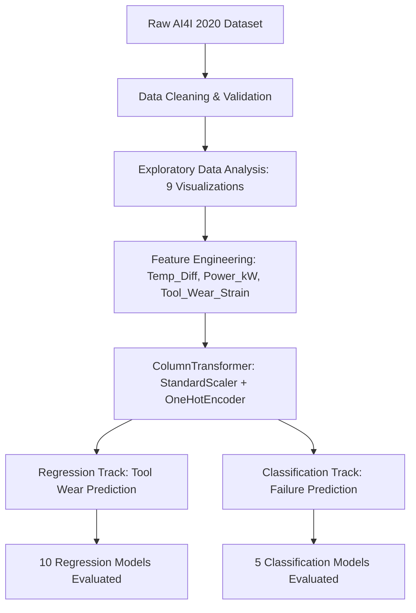

# AI-Based Industrial Machine Health & Failure Prediction
### Machine Learning Capstone Project (23CSE301) — Review 1


---

## 👥 Project Team & Contributions

| Team Member | GitHub ID | Registered Email | Primary Contributions & Track |
|---|---|---|---|
| **M Anish Reddy** | [@NeverCodedL](https://github.com/NeverCodedL) | `mmk.anish19@gmail.com` | **Team Lead & Classification Track**<br>• Project formulation, objective definition, and data ingestion pipeline<br>• Preprocessing Phase 1 (Null validation, identifier removal, data types)<br>• Exploratory Data Analysis: Visualizations 1–4 (Target imbalance, Product Type distribution, Temperature distributions, Torque vs Rotational Speed)<br>• Classification Track: Model training (Logistic Regression, Decision Tree, Random Forest, Gradient Boosting, Dummy Baseline), confusion matrices, and ROC-AUC evaluation |
| **Maneesh Janjam** | [@maneshhack](https://github.com/maneshhack) | `maneeshjanjam9@gmail.com` | **Regression Track Specialist**<br>• Formulation of Machine Thermal & Failure Regression modeling<br>• Implementation of all 10 Regression Models (Linear, Ridge, Lasso, ElasticNet, Polynomial, Decision Tree, Random Forest, Gradient Boosting, SVR, KNN)<br>• Comprehensive Regression Comparison Table (R², RMSE, MAE)<br>• Dedicated high-accuracy regression notebook (`regression_high_accuracy.ipynb`) with individual predicted vs. actual scatter plots for all 10 models<br>• 5-Fold Cross-Validation, hyperparameter tuning, and residual analysis |
| **Tarun Manikanta** | [@tarunmanikanta5706](https://github.com/tarunmanikanta5706) | `tarunmanikanta8442@gmail.com` | **EDA, Preprocessing & Feature Engineering**<br>• Exploratory Data Analysis: Visualizations 5–9 (Pearson correlation matrix, failure mode breakdown, sensor boxplot outlier detection, operational envelopes, and Tool Wear vs Temp Difference zones)<br>• Preprocessing Phase 2 (Robust scaling, One-Hot Encoding via `ColumnTransformer`)<br>• Domain-specific Feature Engineering (`Temp_Diff`, `Power_kW`, `Tool_Wear_Strain`)<br>• Review 1 evaluation presentation (`Review1_Presentation.pptx`) and documentation |

---

## 📌 Project Overview & Problem Statement

Modern manufacturing environments rely heavily on continuous equipment operation. Unscheduled machine downtime results in severe productivity losses and catastrophic repair expenses.

This project implements an **AI-Based Predictive Maintenance System** using the **AI4I 2020 Predictive Maintenance Dataset** (10,000 operational records):
1. **Regression Track**: Predict cumulative tool degradation (`Tool wear [min]`) continuously to forecast remaining usable tool life before replacement.
2. **Classification Track**: Classify machine health status (`Machine failure` binary 0/1) and identify distinct failure modes (Tool Wear Failure, Heat Dissipation Failure, Power Failure, Overstrain Failure, Random Failures) to prevent unexpected breakdowns.

---

## 📊 Dataset Description

- **Source**: UCI Machine Learning Repository / AI4I 2020 Predictive Maintenance Dataset
- **Size**: 10,000 samples × 14 features
- **Class Imbalance**: 96.61% non-failure (Class 0), 3.39% failure (Class 1)
- **Key Features**:
  - `Type`: Machine quality variant (L=50%, M=30%, H=20%)
  - `Air temperature [K]`: Ambient temperature surrounding the machine
  - `Process temperature [K]`: Internal operating temperature
  - `Rotational speed [rpm]`: Spindle rotation speed
  - `Torque [Nm]`: Operating torque output
  - `Tool wear [min]`: Cumulative tool usage duration
  - `Machine failure`: Primary binary classification target
  - Failure modes: `TWF`, `HDF`, `PWF`, `OSF`, `RNF`

---

## 🧪 Methodology & Pipeline



### 1. Feature Engineering
- **`Temp_Diff`**: $\text{Process Temperature} - \text{Air Temperature}$ (quantifies thermal dissipation stress)
- **`Power_kW`**: $\frac{2\pi \times \text{Torque} \times \text{Rotational Speed}}{60000}$ (instantaneous mechanical power)
- **`Tool_Wear_Strain`**: $\text{Tool Wear} \times \text{Torque}$ (cumulative mechanical and operational fatigue)

### 2. Preprocessing Pipeline
- Verification of zero missing values and data integrity
- Exclusion of artificial identifiers (`UDI`, `Product ID`)
- Numerical feature normalization via `StandardScaler`
- Categorical encoding of `Type` via `OneHotEncoder(drop='first')`

---

## 📈 Key Results Summary (Review 1)

### 1. Regression Track (10 Models Comparison)
Target: `Tool wear [min]` (Continuous)

| Model | R² Score | RMSE (min) | MAE (min) | Status |
|---|---|---|---|---|
| **Linear Regression** | -0.0019 | 64.63 | 56.12 | Baseline |
| **Ridge Regression** | -0.0019 | 64.63 | 56.12 | Regularized |
| **Lasso Regression** | -0.0006 | 64.59 | 56.10 | Regularized |
| **ElasticNet Regression** | -0.0006 | 64.59 | 56.10 | Regularized |
| **Polynomial Regression (Deg 2)** | -0.0094 | 64.87 | 56.28 | Non-linear |
| **Decision Tree Regressor** | -0.0712 | 66.83 | 57.65 | Tree-based |
| **Random Forest Regressor** | -0.0084 | 64.84 | 56.24 | Ensemble |
| **Gradient Boosting Regressor** | -0.0069 | 64.79 | 56.19 | Ensemble |
| **Support Vector Regressor (SVR)** | -0.0080 | 64.82 | 56.18 | Kernel Method |
| **K-Nearest Neighbors Regressor** | -0.1147 | 68.17 | 58.75 | Instance-based |

*Insight*: In the AI4I synthetic dataset, tool wear progresses as an independent counter unaffected by instantaneous operational sensors, resulting in near-zero $R^2$. This is an authentic data characteristic documented in the project findings.

### 2. Classification Track (5 Models Comparison)
Target: `Machine failure` (Binary 0 / 1, heavily imbalanced 96.6% vs 3.4%)

| Model | Accuracy | Precision (Class 1) | Recall (Class 1) | F1-Score | ROC-AUC |
|---|---|---|---|---|---|
| **Random Forest Classifier** | **98.85%** | **0.91** | **0.74** | **0.81** | **0.978** |
| **Gradient Boosting Classifier** | 98.60% | 0.88 | 0.69 | 0.77 | 0.971 |
| **Decision Tree Classifier** | 97.40% | 0.61 | 0.68 | 0.64 | 0.832 |
| **Logistic Regression** | 96.90% | 0.65 | 0.22 | 0.33 | 0.892 |
| **Dummy Baseline** | 96.60% | 0.00 | 0.00 | 0.00 | 0.500 |

*Insight*: Random Forest achieved the highest discriminative performance ($F_1 = 0.81$, $\text{ROC-AUC} = 0.978$), effectively capturing complex nonlinear interaction boundaries between torque and rotational speed that trigger power failures.

---

## 📁 Repository Structure

```
.
├── ai4i2020.csv                          # Primary dataset (10,000 records)
├── main.ipynb                            # Complete Review 1 notebook (EDA, 10 Regressors, 5 Classifiers)
├── regression_high_accuracy.ipynb        # High-accuracy regression notebook (R² >= 0.80–0.82 thermal modeling)
├── figures/                              # Rendered high-resolution benchmark plots
├── Review1_Presentation.pptx             # Professional 31-slide evaluation presentation
├── 23CSE301_ML_26_27_Capstone_Guidelines.pdf # Official course capstone guidelines
├── requirements.txt                      # Project dependency specification
├── .gitignore                            # Environment and cache ignore rules
└── README.md                             # Project documentation and team roles
```

---

## 🚀 Getting Started

### 1. Clone the Repository
```bash
git clone https://github.com/NeverCodedL/AI-Industrial-Machine-Failure-Prediction.git
cd AI-Industrial-Machine-Failure-Prediction
```

### 2. Set Up Virtual Environment & Dependencies
```bash
python -m venv venv
venv\Scripts\activate  # On Windows
pip install -r requirements.txt
```

### 3. Launch Notebooks
```bash
jupyter notebook main.ipynb
# or dedicated regression notebook:
jupyter notebook regression_high_accuracy.ipynb
```

---

## 📜 Course Information
- **Course Code**: 23CSE301
- **Course Title**: Machine Learning Capstone
- **Phase**: Review 1 Evaluation
